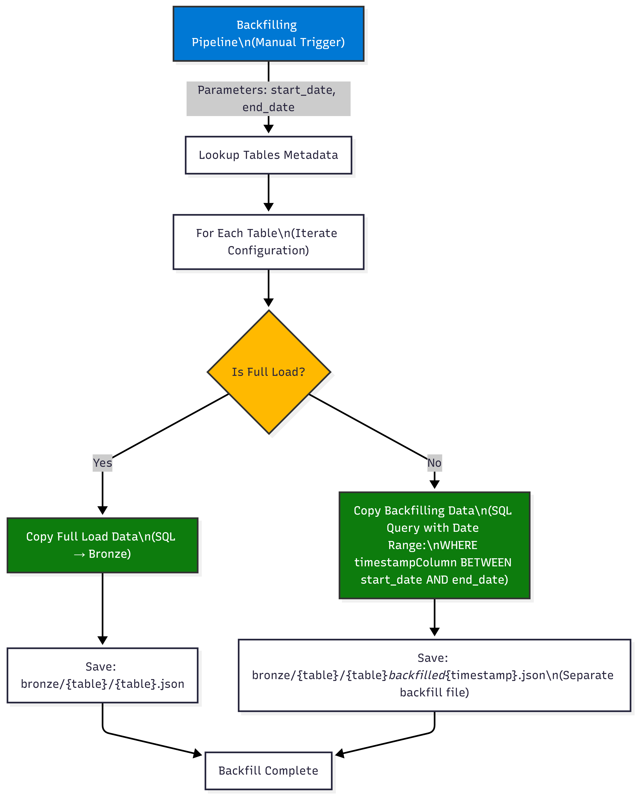

# Azure Data Engineering Project: Spotify Data Ingestion

## End-to-End ADF Pipeline Orchestration

---

## Executive Overview

This project demonstrates a **production-grade metadata-driven data ingestion solution** that orchestrates Spotify data from Azure SQL Database into Azure Data Lake Storage (Bronze) using Azure Data Factory. The architecture supports three ingestion patterns: Full Load, Incremental Load, and Backfilling—all driven by a centralized metadata JSON configuration.

**Key Capabilities:**

- Metadata-driven orchestration for flexible, scalable table ingestion
- Support for Full Load, Incremental Load, and Backfill operations
- Scheduled daily execution with parallel processing (batch size: 3)
- Watermark-based change tracking for incremental loads
- Managed identity-based authentication (secure, no hardcoded credentials)
- Pipeline failure alerting with email notifications

---

## System Architecture


---

## Metadata Configuration

The `adf-pipeline-metadata.json` file is the **single source of truth** for all ingestion jobs:

```json
[
  {
    "schema": "dbo",
    "table": "DimArtist",
    "isFullLoad": true,
    "timestampColumn": "LoadedDate",
    "watermarkTimestamp": "2026-01-01T00:00:00Z"
  },
  {
    "schema": "dbo",
    "table": "FactStream",
    "isFullLoad": false,
    "timestampColumn": "CreatedDate",
    "watermarkTimestamp": "2026-01-03T14:30:00Z"
  }
]
```

| Field                | Purpose                                    |
| -------------------- | ------------------------------------------ |
| `schema`             | Database schema (e.g., `dbo`)              |
| `table`              | Table name to ingest                       |
| `isFullLoad`         | `true` = Full copy; `false` = Incremental  |
| `timestampColumn`    | Column used for incremental detection      |
| `watermarkTimestamp` | Last successful incremental load timestamp |

---

## Pipeline Architecture

### 1. **Ingestion Pipeline** (Main Orchestrator - Scheduled Daily)

**Trigger Configuration:**

- **Frequency:** Every 15 days at 2:00 AM IST
- **Start Date:** 2026-01-05
- **Time Zone:** India Standard Time


**Key Logic:**

1. Reads metadata configuration
2. Iterates all tables in parallel (3 concurrent tables max)
3. Routes based on `isFullLoad` flag
4. For incremental tables: checks for pending changes before invoking child pipeline

---

### 2. **Incremental Ingestion Pipeline** (Change Data Capture)


**Incremental Load Workflow:**

1. Receives parent pipeline context (inputItem, watermark timestamp)
2. Only executes if records exist for ingestion
3. Copies rows where `timestampColumn > watermarkTimestamp`
4. Updates watermark JSON after successful copy
5. Enables next scheduled run to pick up from this point

---

### 3. **Backfilling Pipeline** (Historical Data Catch-Up)

**Purpose:** Bulk-load historical data for a specified date range without affecting incremental operations.



**Use Cases:**

- Recovery from pipeline failures
- Historical data reload for a specific period
- Data correction/remediation

---

## Data Flow: End-to-End Sequence

## 

## Linked Services & Authentication

### Security Architecture

| Component                    | Type                   | Authentication                                             | Purpose                                  |
| ---------------------------- | ---------------------- | ---------------------------------------------------------- | ---------------------------------------- |
| **Azure SQL Linked Service** | AzureSqlDatabase       | System-Assigned Managed Identity                           | Query source tables securely             |
| **ADLS Gen2 Linked Service** | AzureBlobFS            | User-Assigned Managed Identity (`uam-project-spotify-dev`) | Read/write metadata & data files         |
| **Key Vault**                | kv-project-spotify-dev | Not currently used in pipeline                             | Available for secrets (future extension) |

**Benefits:**

- ✅ No hardcoded passwords or connection strings
- ✅ Secure credential rotation through Azure managed identities
- ✅ Audit trail via Azure RBAC
- ✅ Least-privilege access model

---

## Datasets & Parameterization

### AzureSqlTableDataset (Source)

```
Type: AzureSqlTable
Parameters:
  - tableName: string (e.g., "DimArtist")
  - schemaName: string (default: "dbo")

Usage: Dynamically constructs [schemaName].[tableName]
```

### AzureDataLakeDataset (Sink)

```
Type: Json
Parameters:
  - container: string (e.g., "bronze")
  - fileName: string (e.g., "DimArtist/DimArtist.json")

Usage: Writes JSON files with path: container/fileName
```

**Example Parameter Passing (Ingestion Pipeline):**

```
Copy Activity for Full Load:
  Source Dataset Parameters:
    - schemaName: "dbo"
    - tableName: @item().table  (from metadata)

  Sink Dataset Parameters:
    - container: "bronze"
    - fileName: @concat(item().table, '/', item().table, '.json')
```

---

## Data Storage Layout

```
Storage Account: storageprojectspotifydev (ADLS Gen2)
│
├── 📁 adf-pipeline-metadata/
│   ├── 📄 adf-pipeline-metadata.json (Main config)
│   └── 📁 watermarks/
│       ├── 📄 dbo.DimArtist.json ({"watermarkTimestamp": "..."})
│       ├── 📄 dbo.FactStream.json ({"watermarkTimestamp": "..."})
│       └── 📄 dbo.DimTrack.json ({"watermarkTimestamp": "..."})
│
└── 📁 bronze/ (Raw ingestion layer)
    ├── 📁 DimArtist/
    │   └── 📄 DimArtist.json
    ├── 📁 FactStream/
    │   ├── 📄 FactStream_2026-01-03T14:30:00Z.json
    │   └── 📄 FactStream_backfilled_2026-01-03T15:45:22Z.json
    └── 📁 DimTrack/
        └── 📄 DimTrack.json
```

---

## Error Handling & Monitoring

### Pipeline Failure Handling


### Retry & Timeout Policy

- **Retry Count:** 0 (no automatic retries; failures trigger alerts)
- **Activity Timeout:** 12 hours
- **Explicit Fail Activities:** Prevent silent failures (e.g., "Fail If No Look Up Value")

### Key Monitoring Points

- Pipeline run history in ADF Monitor
- Activity output logs (inputs, outputs, errors)
- Watermark file updates (last successful load timestamp)
- Email alerts on pipeline failure

---

## Key Technical Highlights

| Feature                    | Implementation                                      | Benefit                                               |
| -------------------------- | --------------------------------------------------- | ----------------------------------------------------- |
| **Metadata-Driven Design** | adf-pipeline-metadata.json + dynamic parameters     | Single config for N tables; easy to add/remove tables |
| **Incremental Loading**    | Watermark tracking + SQL queries with WHERE clauses | Reduced data transfer; efficient pipeline runs        |
| **Parallel Processing**    | For Each with batchCount: 3                         | Faster ingestion; optimized throughput                |
| **Change Data Capture**    | timestampColumn comparison                          | Identifies only new/modified rows                     |
| **Parameterized Datasets** | Dynamic schemaName, tableName, container, fileName  | Reusable across multiple tables                       |
| **Managed Identity Auth**  | System & User-assigned MI                           | Secure, audit-friendly, no secret rotation overhead   |
| **Version Control**        | Git branches: dev, adf-publish                      | Infrastructure as Code; reproducible deployments      |
| **Backfill Support**       | Date range parameters (start_date, end_date)        | Recovery & historical data reload capability          |

---

## Execution Summary

**Typical Pipeline Run (All 4 Tables: DimArtist, DimTrack, DimUser, FactStream)**

| Phase                 | Duration | Activity                                                               |
| --------------------- | -------- | ---------------------------------------------------------------------- |
| **Metadata Read**     | ~10 sec  | Lookup adf-pipeline-metadata.json                                      |
| **Parallel Batch 1**  | ~2 min   | DimArtist (Full Load) + DimTrack (Incremental) + DimUser (Incremental) |
| **Watermark Updates** | ~30 sec  | Write updated timestamps for incremental tables                        |
| **Parallel Batch 2**  | ~1 min   | FactStream (Incremental)                                               |
| **Total Runtime**     | ~4 min   | End-to-end ingestion for 4 tables                                      |

---

## Scalability & Future Enhancements

**Current Scope:**

- 4 tables from Spotify dataset
- Daily/bi-weekly scheduled runs
- Bronze layer only (no transformations)

**Potential Extensions:**

1. **Data Transformations:** Add Silver/Gold layers with Synapse or Databricks
2. **Schema Evolution:** Handle column additions/deletions automatically
3. **Data Quality Checks:** Validate row counts, nulls, data types post-load
4. **Archival Strategy:** Archive old watermark files, implement data retention policies
5. **Cost Optimization:** Implement dynamic scaling based on data volume
6. **Advanced Monitoring:** Integration with Application Insights for deeper analytics

---

## Project Takeaways

✅ **Production-Grade Architecture:** Demonstrates enterprise data engineering best practices (metadata-driven, modular, secure)

✅ **Scalability & Flexibility:** Designed to handle multiple tables without code changes

✅ **Security:** Managed identities, no hardcoded secrets, audit-ready

✅ **Operations:** Automated monitoring, failure alerting, watermark-based change tracking

✅ **Version Control:** IaC-ready ARM templates, Git integration for CI/CD

✅ **Real-World Problem Solving:** Addresses full load, incremental load, and backfill scenarios

---

**Project Created:** January 2026  
**Tech Stack:** Azure Data Factory, Azure SQL Database, Azure Data Lake Storage Gen2, Managed Identities  
**Status:** Production-Ready
